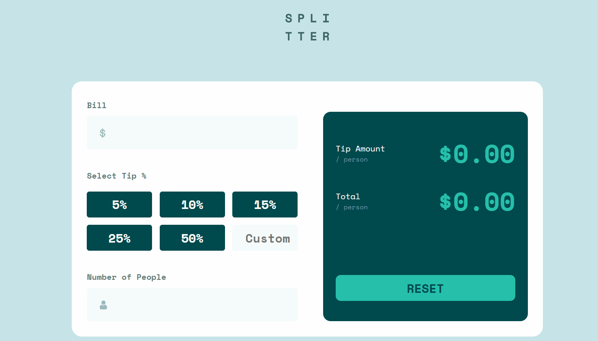
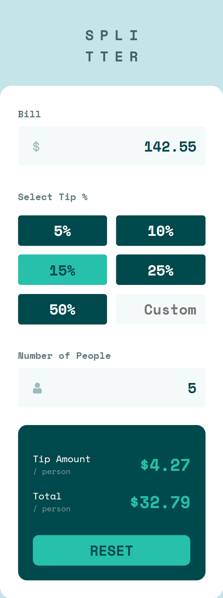

<h1 align="center">React Tip Calculator</h1>

This app was built with React and styled with SCSS.

It is a solution to the [Tip calculator app challenge on Frontend Mentor](https://www.frontendmentor.io/challenges/tip-calculator-app-ugJNGbJUX).

## Links 🌟

- Live site: [Try it out here 💻](https://thethomasy.github.io/React-Tip-Calculator/ 'Live View')

## Screenshots 📷

  
<!--    -->

## Built With 🛠

- React JS
- SCSS

## Future Updates 🎁

- [ ] Add format error message to bill input
- [x] Add error messages
- [x] Change "empty" states of output to be $0.00

## Author 🧑

**Tom Young**

- [Github Profile 👨‍💻](https://github.com/TheThomasY)
- [Email ✉](mailto:tomyoungdev@gmail.com?subject=Hi 'Hi!')
- [LinkedIn 💼](https://www.linkedin.com/in/tom-young5555/)
- [Dev.to 🖊](https://dev.to/thetomy)

Give a ⭐️ if you like this project!
